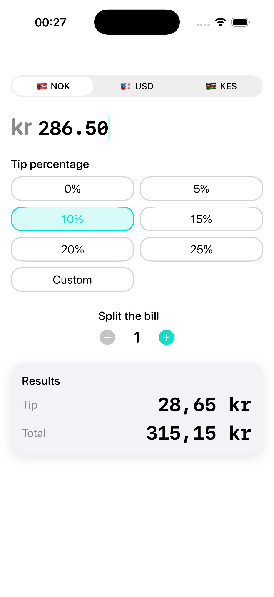
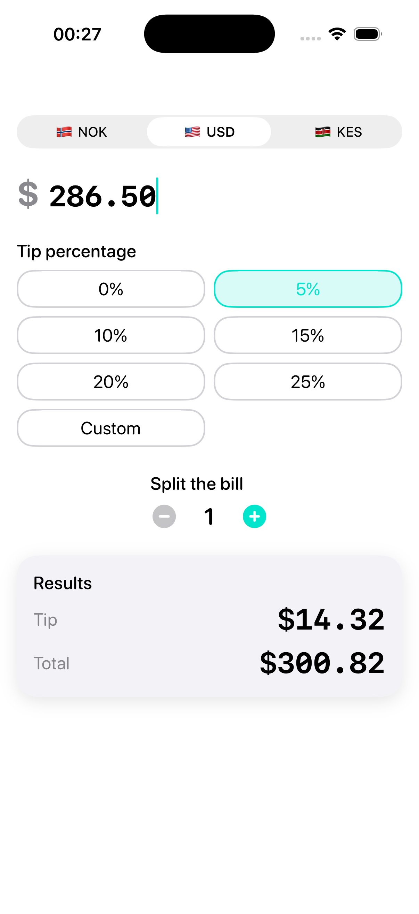
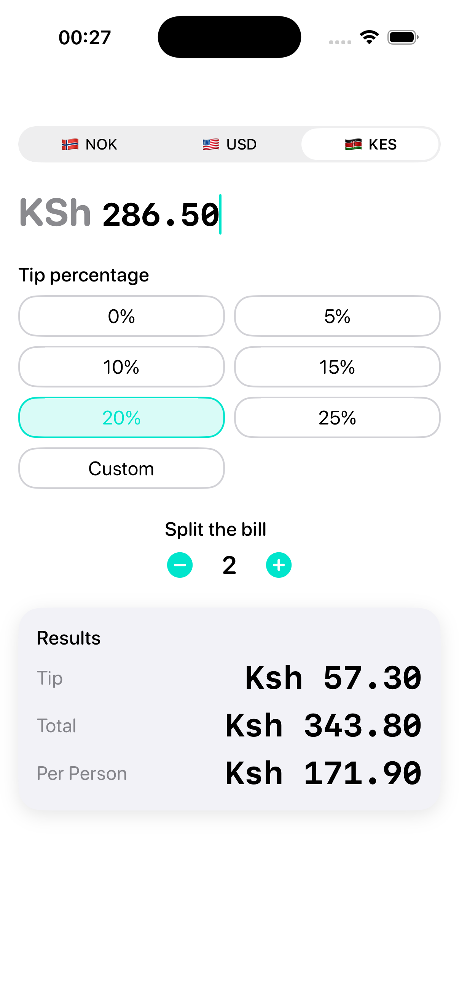

# BillBuddy

A native iOS tip calculator and bill splitter — built with SwiftUI, zero external dependencies.

> Calculate tips, split bills, and format amounts in NOK, USD, or KES — all in a single, polished screen.

<p align="center">
  
  
  
</p>

---

## Tech Stack

| Layer        | Technology                          |
|--------------|-------------------------------------|
| Language     | Swift 5.9+                          |
| UI Framework | SwiftUI                             |
| Architecture | MVVM with `@Observable`             |
| Min Target   | iOS 17+                             |
| Dependencies | None — Apple frameworks only        |
| Persistence  | `@AppStorage` (UserDefaults)        |
| Haptics      | `UIImpactFeedbackGenerator`         |
| Formatting   | `NumberFormatter` (locale-aware)    |

---

## Features (V1)

- **Tip Calculator** — 6 preset buttons (0–25%) + custom slider (0–50%)
- **Bill Splitting** — equal split for 1–20 people
- **Multi-Currency** — NOK (kr), USD ($), KES (KSh) with locale-correct formatting
- **Dark-Mode-First** — teal accent (#00E5CC), elevated glass cards, high-contrast text
- **Haptic Feedback** — tactile responses on tip selection, split changes, and first result
- **Spring Animations** — smooth value transitions and staggered card entrances
- **Persistent Preferences** — currency, tip %, and split count saved across sessions

---

## Getting Started

### Prerequisites

- macOS with **Xcode 16+** installed
- iOS 17+ Simulator or physical device

### Setup

```bash
# Clone the repository
git clone https://github.com/your-username/billBudy.git
cd billBudy

# Open in Xcode
open billBudy.xcodeproj
```

### Build & Run

**Xcode:** Select the `billBudy` scheme, choose an iPhone 16 simulator, and press `Cmd + R`.

**Command line:**

```bash
xcodebuild -project billBudy.xcodeproj -scheme billBudy -destination 'platform=iOS Simulator,name=iPhone 16' build
```

---

## Project Structure

```
billBudy/
├── billBudyApp.swift       # @main entry point
├── ContentView.swift        # Root view
├── Models/                  # TipPreset, Currency, TipCalculation
├── ViewModels/              # CalculatorViewModel (@Observable)
├── Views/                   # Calculator, Results, Components
├── Services/                # HapticManager, CurrencyFormatter
├── DesignSystem/            # AppColors, AppTypography, AppSpacing
├── Extensions/              # View + Double helpers
└── Assets.xcassets/         # App icon, AccentColor (#00E5CC)
```

---

## Roadmap

| Version | Focus | Status |
|---------|-------|--------|
| **V1** | Tip calculator, bill splitting, multi-currency display, dark-mode UI | Done |
| **V2** | Unequal splits, live currency conversion, receipt scanner, bill history, widgets | Planned |
| **V3** | Payment links (Vipps/M-Pesa), region-aware tips, multi-language, AI input, Apple Watch | Planned |

---

## Documentation

| Document | Description |
|----------|-------------|
| [plan.md](docs/plan.md) | Feature specs and roadmap (V1/V2/V3) |
| [ARCHITECTURE.md](docs/ARCHITECTURE.md) | MVVM architecture, folder structure, ViewModel design |
| [STYLE-GUIDE.md](docs/STYLE-GUIDE.md) | Design tokens — colors, typography, spacing |
| [TASKS.md](docs/TASKS.md) | Development to-do list by milestone |
| [TESTING.md](docs/TESTING.md) | Test strategy, coverage goals, QA checklists |
| [CHANGELOG.md](docs/CHANGELOG.md) | Version history |

---

## Bundle ID

`com.hurud.billBudy`

---

## License

TBD

---

## Author

Built by moha.
