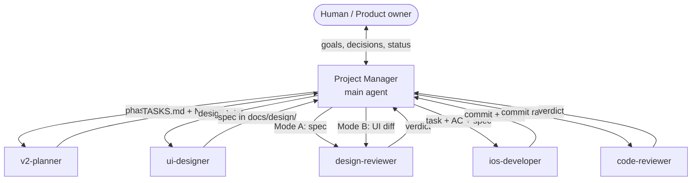
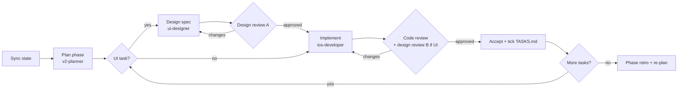

# Agent System

How BillBuddy is developed by a team of Claude Code agents: one **Project Manager** (the main agent) and five specialized **sub-agents**. The PM delegates the work and gates quality.

- **Agent definitions:** `.claude/agents/*.md`
- **PM playbook:** `.claude/skills/project-manager/SKILL.md`
- **To start:** open Claude Code in the repo and run `/project-manager` (optionally followed by a goal, such as `/project-manager work on Phase 2A`).

---

## 1. Goals

| Goal | How the system achieves it |
|------|----------------------------|
| **Clear delegation** | Each agent has one job, a narrow tool set, and a fixed output format. The PM is the only agent that decides what happens next. |
| **Continuous verification** | No design reaches code without a Mode A design review. No code is accepted without a code review, plus a Mode B design review if it touches UI. |
| **Iterative improvement** | Reviewer findings go back to the author verbatim, capped at 3 rounds. Non-blocking findings feed a backlog, and each phase ends with a re-plan. |
| **Efficiency** | Reviewers run in parallel, design for task N+1 overlaps with development of task N, and every sub-agent works in its own context window so the PM stays lean. |
| **Honest status** | Reports separate "pass" from "not run". The PM verifies commits and test claims before it accepts work. |

---

## 2. Roles

### Project Manager (main agent)

- **Owns:** the workflow, priorities, the live task board, communication between agents, escalation to the human, and final acceptance.
- **Does not do:** design, detailed planning, or feature code.
- **Tools:** everything, but it mostly uses `Agent` (delegation), TaskCreate/TaskUpdate (the live board), git (verification), and AskUserQuestion (decisions).

### Sub-agents

| Agent | Expertise | Writes | Tools (least privilege) |
|-------|-----------|--------|-------------------------|
| `ui-designer` | UI research and design specs, using Mobbin via its MCP server, Apple HIG, and Figma | `docs/design/*.md`, and `(proposed)` rows in `STYLE-GUIDE.md` | Read/Write docs, WebSearch, Mobbin MCP, Figma MCP. **No Swift edits.** |
| `design-reviewer` | Checking designs and UI code against HIG, STYLE-GUIDE, and accessibility | Nothing (read-only) | Read, Grep, Bash (git), Mobbin (spot-checks) |
| `v2-planner` | Breaking V2 into tasks, dependencies, estimates, and risks | `docs/TASKS.md`, `docs/plan.md` | Read, Edit, Bash (git log) |
| `ios-developer` | Swift/SwiftUI implementation and unit tests | `billBudy/`, `billBudyTests/`, and the docs its change affects. It commits but doesn't push. | Read, Edit, Write, Bash (xcodebuild, git) |
| `code-reviewer` | Correctness, Swift best practices, conventions, and test quality | Nothing (read-only) | Read, Grep, Bash (git diff, xcodebuild test) |

Keeping the reviewers read-only is deliberate. A reviewer that can "just fix it" stops being an independent check.

---

## 3. System overview



Sub-agents never talk to each other directly. All communication goes **through the PM**, which relays findings verbatim. This keeps one source of truth for state, makes every hand-off visible, and lets the PM catch conflicts, such as a design reviewer asking for something that the code reviewer flags as a performance risk.

**Shared memory is the repository itself:**

| Artifact | Owner | Readers |
|----------|-------|---------|
| `docs/plan.md`, `docs/TASKS.md` | v2-planner (the PM ticks boxes) | everyone |
| `docs/design/<phase>-<slug>.md` | ui-designer | design-reviewer, ios-developer, code-reviewer |
| `docs/STYLE-GUIDE.md` | ui-designer proposes, ios-developer finalizes | everyone |
| Source and tests, `ARCHITECTURE.md`, `CHANGELOG.md` | ios-developer | reviewers |
| Git history | ios-developer commits, PM pushes | PM and reviewers verify against it |

---

## 4. Workflows

### 4.1 Phase lifecycle



### 4.2 Step by step

1. **Sync.** The PM reads `TASKS.md`, recent git history, and the working tree, then builds a live board with one entry per task.
2. **Plan.** The PM sends `v2-planner` a phase brief. The planner slices the phase into tasks of about 1–3 hours each, sized to one reviewable commit. Each task has an ID (`2A-1`…), dependencies, an estimate, and acceptance criteria (AC). The planner returns a **Next up** queue, where every task's dependencies are already met.
3. **Design gate** (UI tasks only).
   - The PM writes a design brief covering the feature, the user problem, the constraints, and the affected views.
   - `ui-designer` researches at least 3 comparable flows on Mobbin, checks the Apple HIG, and writes a spec with a research table, user flow, per-view specs using only tokens, states, accessibility, and acceptance criteria.
   - `design-reviewer` (Mode A) returns a verdict. On CHANGES REQUESTED, the PM sends the BLOCKING items back to the designer with their IDs.
4. **Build.** The PM gives `ios-developer` **one** task: its ID, AC, spec path, and relevant files. The developer implements the change, writes Swift Testing tests, builds with zero warnings, runs the tests, updates the affected docs, commits, and reports.
5. **Review gate.**
   - The PM first verifies the report: the commit exists, and the build and test status is stated honestly.
   - It then runs `code-reviewer`, and `design-reviewer` in Mode B if the change touched UI (`billBudy/Views/` or `billBudy/DesignSystem/`), **in parallel**.
   - The PM merges the BLOCKING findings from both reviewers into one fix brief. Who re-reviews the fix depends on what the fix changed, not on who objected. `code-reviewer` always re-reviews. `design-reviewer` re-reviews in Mode B whenever the fix touches UI, even if it approved the previous round. Otherwise a fix could change a view, or add code nobody reviewed, after that gate had already passed.
6. **Accept.** When every gate is APPROVED, the PM:
   - ticks the task in `TASKS.md` and closes it on the board
   - files non-blocking findings and developer follow-ups in a phase backlog
   - pushes, if the user has authorized pushing
   - posts a short status update
7. **Phase close.** The PM runs the planner again with the backlog and lessons learned, such as tasks that took more fix rounds than expected, then starts the next phase.

### 4.3 Feedback-loop rules

- **Round cap.** At most 3 review rounds per gate. A 4th round means the brief, spec, or task is wrong, so the PM escalates to the human or asks the planner to re-slice the task.
- **Blocking vs non-blocking.** Reviewers may mark a finding BLOCKING only when it has a concrete failure scenario or breaks a written rule (in CLAUDE.md, STYLE-GUIDE, the HIG, or accessibility requirements). Taste-level feedback is never blocking, which stops endless polishing.
- **Verbatim relay.** Findings keep their IDs (`[B1]`, `[N2]`) end to end. The developer must answer every one of them.
- **Re-review scope.** A re-review checks that each earlier `[B#]` is resolved, and looks for regressions in the new diff only.

---

## 5. Communication protocol

Every hand-off follows a fixed structure. This is what makes the system predictable.

**PM → sub-agent brief** (sub-agents don't see the PM's conversation, so each brief must stand alone):

```
ROLE CONTEXT: BillBuddy, iOS 17 SwiftUI tip calculator, see CLAUDE.md
TASK: 2A-4 SplitModeToggle
GOAL: <one sentence>
ACCEPTANCE CRITERIA: <list>
INPUTS: spec docs/design/2A-unequal-splits.md §4.1; files: …
PRIOR VERDICTS: code-reviewer round 1 — [B1] …, [B2] …
RETURN: the report format defined in your agent file
```

**Sub-agent → PM**: always one of the fixed report formats defined in the agent files.

| Agent | Report |
|-------|--------|
| ui-designer | the spec path, a 5-line summary, and open questions |
| design-reviewer | `VERDICT / MODE / BLOCKING / NON-BLOCKING / VERIFIED` |
| v2-planner | `Milestones / Next up / Blocked / Risks` |
| ios-developer | `TASK / STATUS / COMMIT / BUILD / TESTS / AC / NOTES / FOLLOW-UPS` |
| code-reviewer | `VERDICT / BLOCKING / NON-BLOCKING / AC CHECK / QUALITY SCORE` |

**PM → human**: a 3–6 line status block after each accepted task (format in the PM skill). The PM also asks one consolidated question whenever a product decision is needed.

---

## 6. Quality assurance

| Layer | Who | What is checked |
|-------|-----|-----------------|
| Design research | ui-designer | Mobbin references (≥ 3), HIG, BillBuddy principles |
| Spec gate (A) | design-reviewer | Uses only tokens, HIG conformance, accessibility (44 pt targets, Dynamic Type AX5, VoiceOver, 4.5:1 contrast, Reduce Motion), all states defined, feasible on iOS 17 |
| Self-check | ios-developer | Build with zero warnings, all tests passing, AC met, docs updated |
| Code gate | code-reviewer | Correctness (money math, locales, edge cases), `@Observable`/concurrency, CLAUDE.md conventions (grep for banned APIs), test quality, performance, docs |
| Implementation gate (B) | design-reviewer | The SwiftUI code matches the approved spec, uses tokens only, has accessibility modifiers, and has `#Preview` blocks for light and dark mode |
| Acceptance | PM | Verifies the commit exists, that "not run" is never reported as "pass", and that every verdict is APPROVED |
| Phase exit | v2-planner and PM | Phase exit criteria from the plan; Phase 4 runs the cross-feature audit |

**Quality metrics tracked by the PM** (reported at each phase close):

- fix rounds per task (target ≤ 1 on average)
- code-reviewer quality score (target ≥ 4/5)
- blocking findings per task, broken down by category (correctness, conventions, accessibility, and so on). A recurring category means the planner should add guidance, or the agent file should be tightened.
- estimated vs actual tasks per phase
- test count, and whether the build is warning-free

---

## 7. Efficiency

- **Context isolation.** Each sub-agent reads what it needs and returns a compact report. The PM's context holds only decisions and verdicts, not file dumps.
- **Parallelism.** These things run concurrently:
  - `code-reviewer` alongside `design-reviewer` in Mode B
  - `ui-designer` working on the next UI task alongside `ios-developer` on the current one
  - planning of the next phase during the final reviews of the current one

  Agents that write to the same files never run in parallel.
- **Least privilege.** Narrow tool lists keep each agent focused, and they stop reviewers from drifting into implementation.
- **Small tasks.** Commits of about 300 lines or fewer keep reviews fast and accurate, and make a rejected change cheap to redo.
- **Early design gate.** Catching layout or accessibility problems in a Markdown spec costs far less than catching them in SwiftUI.

---

## 8. Monitoring and escalation

The PM monitors progress continuously:

- **Live board.** Each task moves `pending → in progress (design | dev | review) → completed`.
- **Health checks** after each hand-off:
  - Did the agent return the required format?
  - Does its claim match the repo (commit present, file written)?
  - Is the task stuck? Stuck means over 3 rounds, or about 2× its estimate.
- **Escalate to the human when:**
  - a product decision is needed (for example, choosing a currency-rate API for 2B, or moving a feature to V3)
  - reviewers disagree with each other
  - a round cap is hit
  - an environment limit blocks verification (for example, no `xcodebuild` on Linux)
- **Re-plan triggers:** a task is split during development, a new risk is discovered, or the backlog grows by more than about 5 items in a phase.

---

## 9. Worked example: Phase 2A (Unequal Splits)

1. **PM** runs `v2-planner` on Phase 2A. The planner returns tasks 2A-0 through 2A-9. It makes 2A-0 the design spec, adds a new task 2A-9 for rounding with custom splits (a risk it spotted from Phase 1B), and marks 2A-1 and 2A-2 (the models) as parallel-safe.
2. **PM** briefs `ui-designer`. The designer studies the Splitwise, Tricount, and Settle Up split flows on Mobbin and specifies:
   - a segmented `SplitModeToggle` (equal / custom)
   - a `PersonSplitRow` list inside a `GlassCard`
   - a live "remaining to allocate" indicator that uses text *and* color

   It writes `docs/design/2A-unequal-splits.md`.
3. **design-reviewer (A)** requests changes:
   - `[B1]` the remaining indicator relies on red alone
   - `[B2]` there's no AX5 layout for the amount and percent fields

   The designer revises, and round 2 is APPROVED.
4. Meanwhile, **ios-developer** implements 2A-1 (`SplitMode`). **code-reviewer** approves it with a quality score of 5/5. The PM ticks the box.
5. **2A-3** (per-person breakdown in the ViewModel): **code-reviewer** blocks it with `[B1]`. Summing rounded shares loses a cent: 100 / 3 gives 33.33 × 3 = 99.99. The PM relays the finding verbatim. The developer assigns the remainder to the last person and adds a test. The re-review is APPROVED.
6. **2A-5** (`PersonSplitRow`): the code and design (B) reviews run in parallel. Both approve. The design reviewer adds `[N1]` (a stagger animation on insert), which the PM files in the backlog.
7. At phase close, the **PM** reports to the user: 10/10 tasks done, 0.6 fix rounds per task on average, 58 tests, and a warning-free build. It then runs the planner for Phase 2B, carrying `[N1]` and one open question: which exchange-rate API to use (sent to the human).

---

## 10. Running and extending

- **Run the full loop:** `/project-manager` or `/project-manager continue Phase 2B`
- **Run one agent directly:** ask for it by name, for example "Use the code-reviewer agent on HEAD~1..HEAD".
- **Add a specialist:** create `.claude/agents/<name>.md` with a narrow tool list and a fixed report format, add it to the team table in the PM skill, and choose where it sits in the workflow (a gate or a producer). A natural candidate is an `accessibility-auditor` or a `release-manager` for Phase 4.
- **Tune quality:** when one blocking category keeps recurring, add the rule to CLAUDE.md or to the author agent's file, so the problem is prevented upstream instead of caught downstream.
